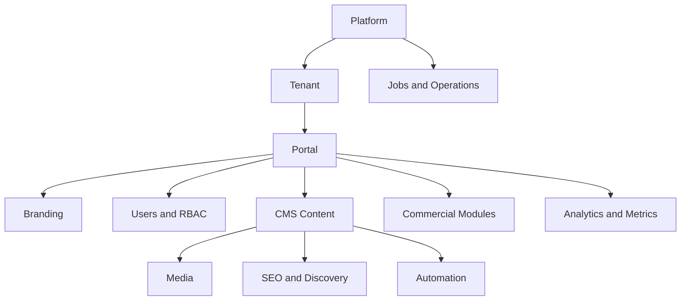

# Domain Map

## Dominios Atuais

- Tenant/Branding: tenants, dominios, features, settings persistidos e fallback por env.
- Users/RBAC: usuarios, roles, permissoes e auditoria.
- CMS: posts, categorias, tags, revisoes, status editorial.
- Media: upload, validacao, thumbnails e storage local.
- SEO: sitemap, robots, RSS, JSON-LD, OG/Twitter.
- Automation: RSS sources, runs e jobs.
- Commercial: lojas, promocoes, eventos, classificados, influencers, bairros e banners.
- Operations: health, metrics, backups, jobs e logs.
